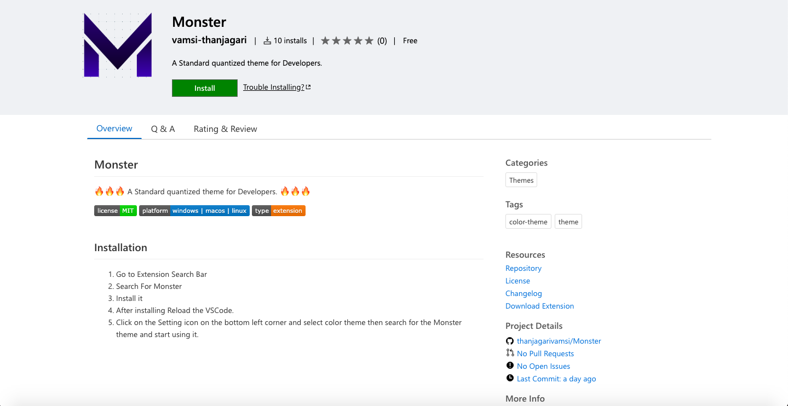

# Monster

🔥🔥🔥 A Standard quantized theme for Developers. 🔥🔥🔥

## Installation

1. Go to Extension Search Bar
2. Search For Monster
3. Install it
4. After installing Reload the VSCode.
5. Click on the Setting icon on the bottom left corner and select color theme then search for the Monster theme and start using it.

